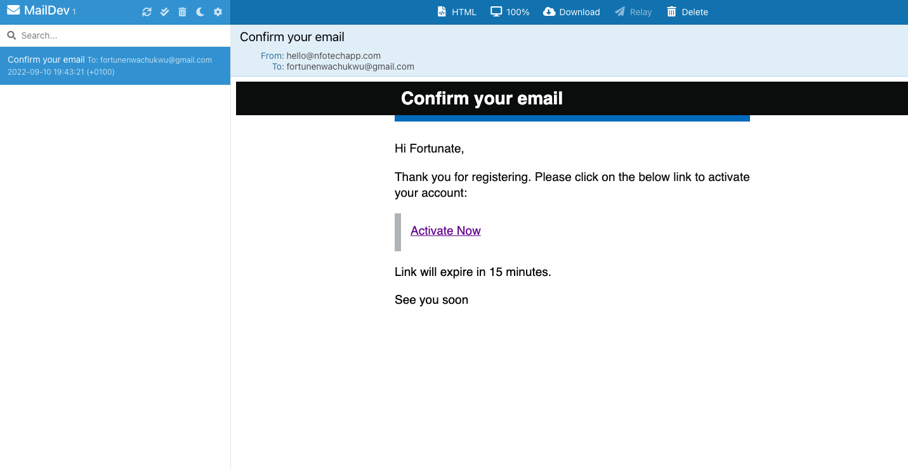
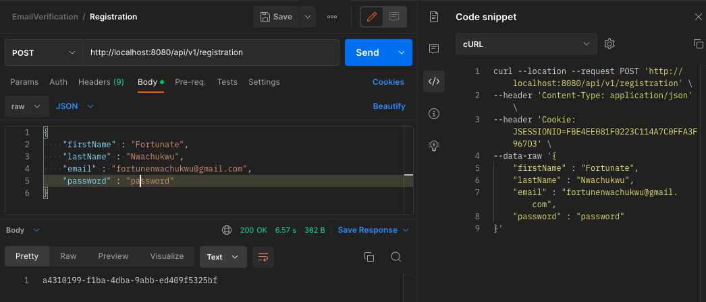

## User Registration With Email Verification using Spring Security

This is a sample application that demonstrates how to implement user registration with email verification using Spring Security.

---
### Email Verification Page with expiry time


---
### Postman Request



---
### Curl Request

```
curl --location --request POST 'http://localhost:8080/api/v1/registration' \
--header 'Content-Type: application/json' \
--header 'Cookie: JSESSIONID=FBE4EE081F0223C114A7C0FFA3F967D3' \
--data-raw '{
    "firstName" : "Fortunate",
    "lastName" : "Nwachukwu",
    "email" : "fortunenwachukwu@gmail.com",
    "password" : "password"
}'
```
